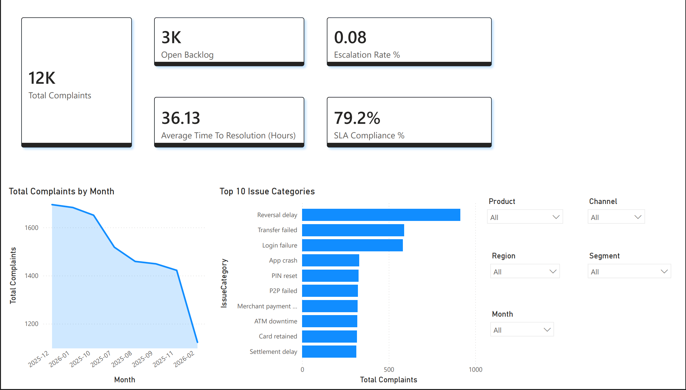
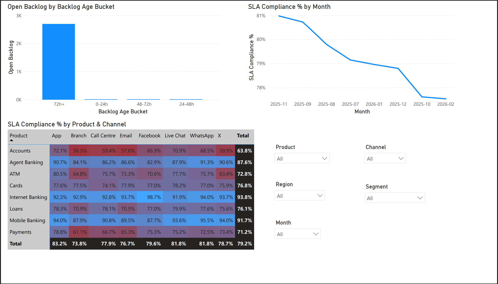
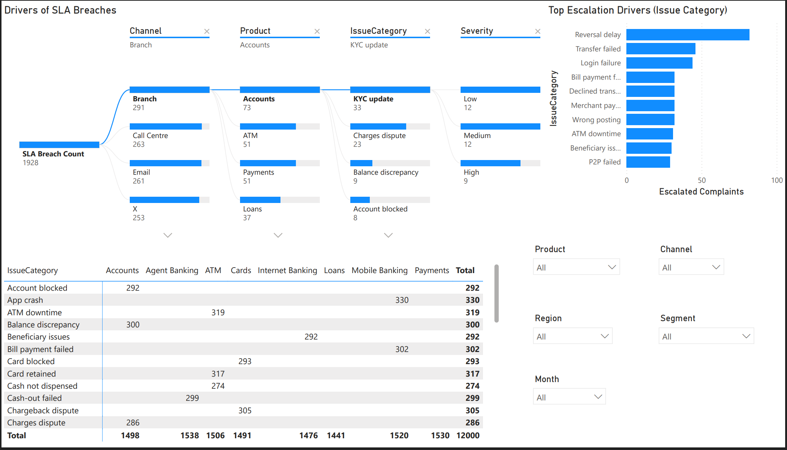
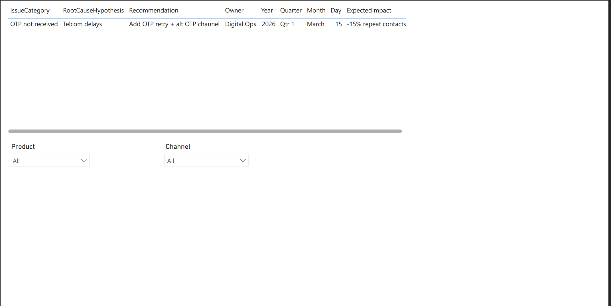

# CX Complaints Analytics Dashboard (Synthetic Banking Data)

A Power BI dashboard built on synthetic banking CX complaint data to monitor complaint volume, backlog aging, SLA performance, escalation drivers, and customer experience outcomes. Includes a root-cause deep dive and an Action Tracker to translate insights into owners, ETAs, and expected impact.

**What it demonstrates**
- CX KPI reporting (volume, CSAT, FRT, TTR)
- SLA control (eligibility, compliance, breaches)
- Backlog aging (bucketed open/escalated cases)
- Driver analysis (decomposition tree + heatmap hotspots)
- Action planning (recommendations, ownership, ETA, expected impact)

**Key skills / tools**
Power BI • Data modeling (star schema) • DAX measures • Metric definitions • Dashboard storytelling

---

## Dashboard Preview (Screenshots)

### 1) Executive Overview

### 2) SLA & Backlog Control

### 3) Issue Deep Dive (Root Cause)

### 4) Action Tracker

---

## Report Export (PDF)
- Full report (PDF): `docs/CX_Complaints_Analytics_Dashboard.pdf`

> Tip: If you rename the PDF, update the filename above.

---

## Data Model (High Level)

**Tables**
- `Fact_Complaints` (complaints/events)
- `Dim_Date` (calendar table for time slicing)
- `Action_Tracker` (manually maintained actions table)

**Why Dim_Date**
- Consistent monthly/weekly reporting
- Proper time slicing and time intelligence readiness
- Prevents missing date gaps on charts

**Relationships (typical setup)**
- `Dim_Date[Date] (1)` → `Fact_Complaints[DateOpened_Date] (*)` (Active)
- Optional: `Dim_Date[Date] (1)` → `Fact_Complaints[DateClosed_Date] (*)` (Inactive, used with `USERELATIONSHIP` when needed)

---

## KPIs & Metric Definitions (Core)

- **Total Complaints**: All complaint records in the current filter context  
- **Open Backlog**: Complaints with Status in `Open` or `Escalated`  
- **Avg TTR (Hours)**: Average hours between DateOpened and DateClosed for valid Closed cases  
- **SLA Compliance %**: `% of eligible Closed cases resolved within SLA_Target_Hours`  
- **Escalation Rate %**: `% of complaints escalated`  
- **Avg FRT (Minutes)**: Average first response time  
- **Avg CSAT**: Average satisfaction score (if present)

---
## Repo Structure

---

## Notes
- Dataset is synthetic (no customer PII).
- Built to reflect a banking CX complaints environment (channels, products, SLA targets, escalation behavior).

---

## Contact
If you’d like a walkthrough of the model or a similar dashboard built on real operational data, reach out via GitHub or LinkedIn.
